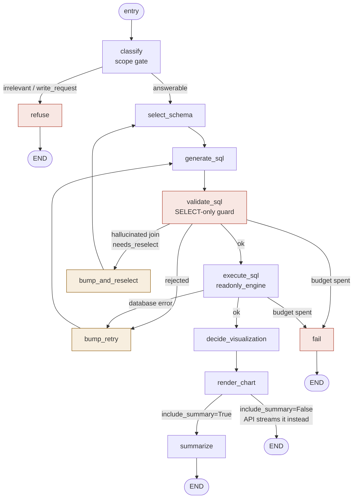
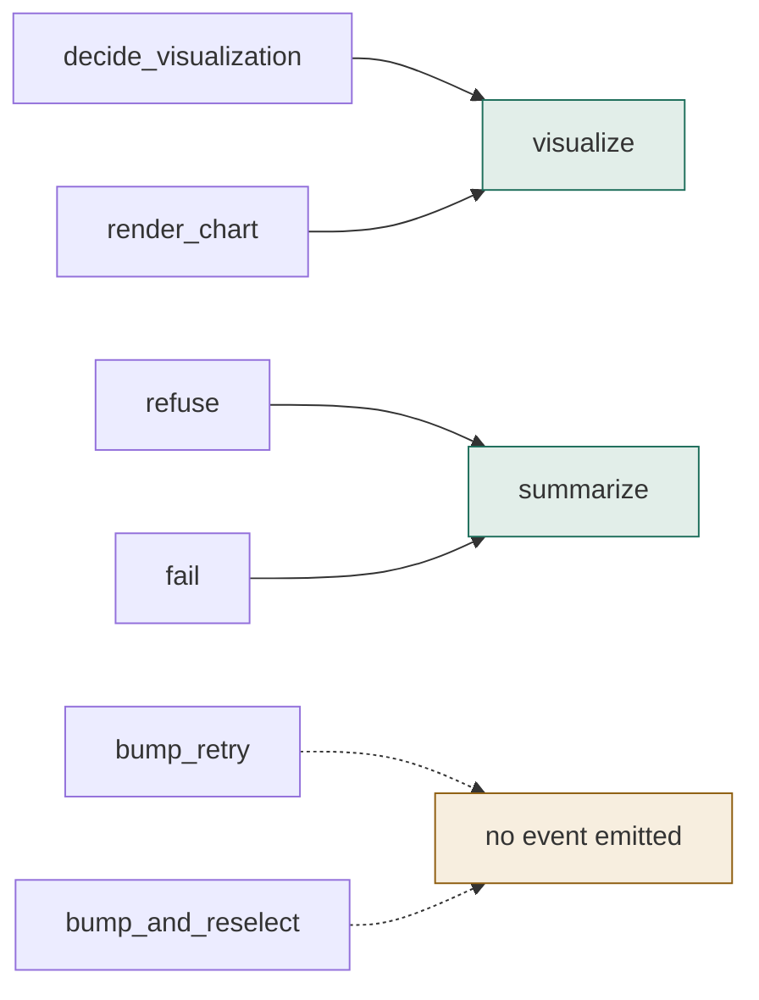
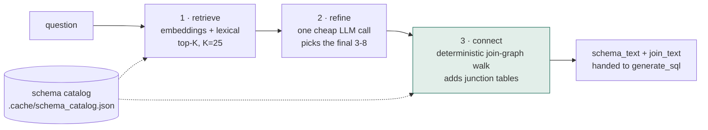
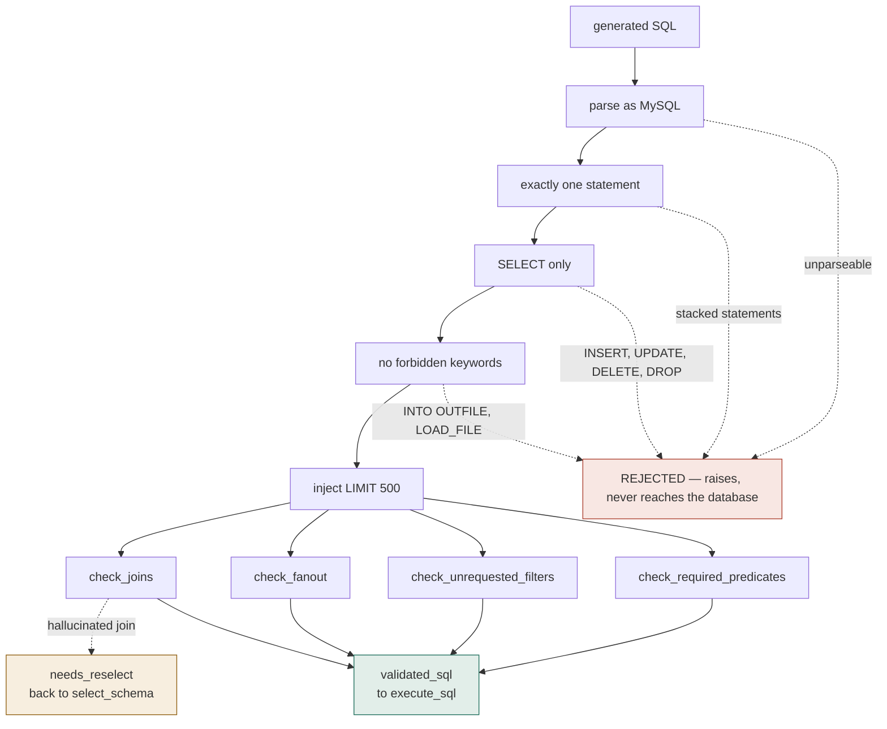
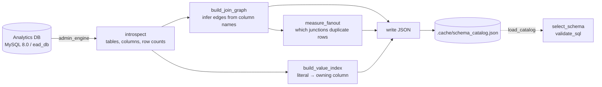
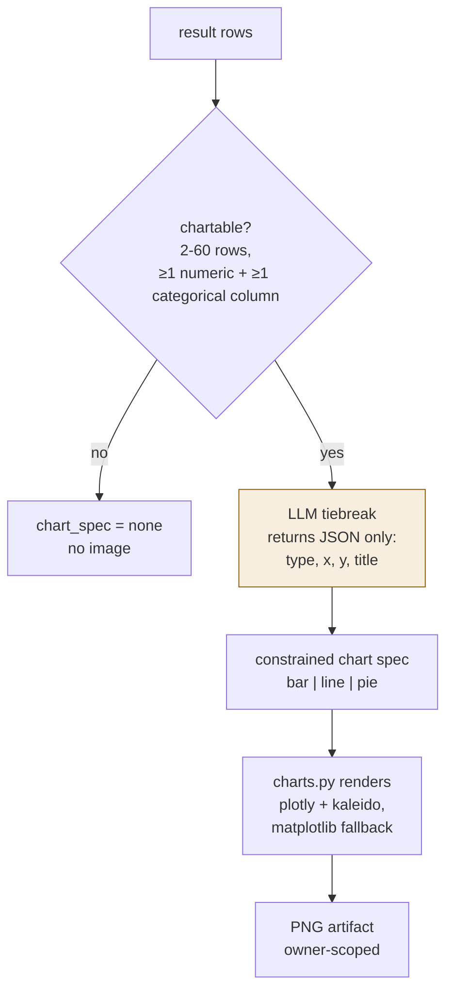

# SQL-RAG Agent Architecture

The `ead_agent` package: a LangGraph text-to-SQL pipeline over the EAD analytics
database. It knows nothing about users, HTTP, or authentication — it takes a
question and returns an answer, the SQL that produced it, and optionally a chart.

Verified against source: graph topology from `ead_agent/graph.py`, stage mapping
from `ead_api/agent/runner.py`, guard checks from `ead_agent/nodes/validate_sql.py`,
defaults from `ead_agent/config.py`.

## 1. The graph

Thirteen nodes and three conditional branches. The scope gate runs **first**, so
an irrelevant or write-intent question ends at `refuse` having generated no SQL
and touched no table.

**One retry budget, two repair paths.** Guard rejections and database errors feed
the same counter, so a query rejected twice then erroring once still stops at
`MAX_RETRIES` (default 3) total.

The two paths differ in where they re-enter:

| Path | Re-enters at | Used when |
|---|---|---|
| `bump_retry` | `generate_sql` | The SQL was wrong — regenerate with the error as a hint |
| `bump_and_reselect` | `select_schema` | The **tables** were wrong. Regenerating against the same table set reproduces the same bad join, so the offending table is excluded and selection runs again |

`execute_sql` captures database errors into state rather than raising, so the
graph can route back with the database's own message as grounded feedback.

## 2. Nodes are not stages

The API collapses 13 graph nodes into 7 `agent.stage` event names, and suppresses
consecutive duplicates. This is why a stream shows seven stages regardless of how
many nodes actually ran.

Five nodes map one-to-one onto the stage of the same name. Only these six are
interesting:

Two collapses and two silences. `decide_visualization` and `render_chart` both
report `visualize`; `refuse` and `fail` both report `summarize` — so a refusal
looks like a normal turn ending, from the client's point of view.

The retry nodes emit nothing at all, which means **a repair loop is invisible in
the event stream**. The runner also suppresses consecutive duplicates, so a
rejected statement that regenerates and passes shows `generate_sql` once, not
twice. Use `retry_count` on the run record to see repairs, not the event log.

## 3. Schema selection — three phases

146 tables times ~9 columns will not fit in a prompt, and stuffing them in would
bury the signal even if it did.

**Phase 3 is deliberately not delegated to the model.** With one real foreign key
in the whole schema, a hallucinated join condition is the most likely way to get
a wrong answer that still executes. The join graph is inferred once and walked
deterministically.

Selection also steers away from look-alike tables. `project_to_foreigndetails`
is a per-tranche sub-breakdown with far fewer rows than
`project_to_foreigncecomponents`; picking it silently undercounts. The canonical
table wins unless the question contains an explicit trigger word such as
"tranche" or "loan-wise".

## 4. SQL safety — layered validation

| Check | Looks for |
|---|---|
| `check_joins` | Join conditions that don't exist in the inferred graph |
| `check_fanout` | Junction tables that duplicate rows and inflate counts |
| `check_unrequested_filters` | `WHERE` clauses the question never asked for |
| `check_required_predicates` | Filters the question implies but the SQL omits |

The syntactic guard is absolute — it raises and the query never runs. The four
semantic checks are advisory: they produce a rejection reason that feeds
self-repair rather than an exception.

Belt and suspenders: even if the guard were bypassed entirely, `execute_sql`
runs as `ead_ro`, a MySQL account holding only `GRANT SELECT`, so a write fails
at the server.

## 5. Schema catalog — built once, cached

Rebuild with `python scripts/catalog_cli.py --rebuild`. On the bundled dummy
dataset this yields 145 tables, 214 inferred joins, 110 primary keys and 18
isolated tables.

`admin_engine` is the only consumer here, and it never runs generated SQL —
introspection bypasses the guard entirely because it reads schema metadata, not
model output.

## 6. Visualization — heuristics veto, the model only tiebreaks

**The model never sees or writes plotting code.** It returns four fields and
`charts.py` does the drawing, which is what makes chart generation deterministic
and safe.

## 7. State and knobs

`AgentState` is a `TypedDict` threaded through every node.

| Group | Fields |
|---|---|
| input | `question` |
| classify | `verdict`, `reject_reason` |
| select_schema | `candidate_tables`, `selected_tables`, `schema_text`, `join_text`, `value_text` |
| sql | `sql`, `validated_sql`, `columns`, `rows` |
| repair | `error`, `retry_count`, `attempts`, `banned_tables`, `needs_reselect` |
| chart | `chart_spec`, `chart_path`, `chart_figure` |
| output | `answer`, `failed` |

`attempts` is an audit trail of every try, so a run that repaired twice records
all three statements and both rejection reasons.

| Setting | Default | Effect |
|---|---|---|
| `MAX_RETRIES` | 3 | Shared budget across guard rejections and database errors |
| `ROW_LIMIT` | 500 | `LIMIT` injected into every validated statement |
| `QUERY_TIMEOUT_SECONDS` | 30 | Read timeout on the analytics connection |
| `TOP_K_TABLES` | 25 | Candidates from retrieval before the refine call |
| `EMBED_PROVIDER` | `huggingface` | `lexical` short-circuits retrieval to keyword scoring, no model needed |

## 8. Where the LLM is used, and where it is not

Four model calls per successful run, each narrow.

| Node | Model does | Model does **not** |
|---|---|---|
| `classify` | Judge scope: answerable / irrelevant / write_request | Decide what the answer is |
| `select_schema` | Pick 3-8 tables from 25 candidates | Write join conditions — the graph walk does that |
| `generate_sql` | Write one MySQL SELECT | Execute anything |
| `decide_visualization` | Choose chart type and axes | Write plotting code |
| `summarize` | Phrase the answer from returned rows | Introduce any number not in the result table |

Everything structural — joins, LIMIT injection, fan-out detection, chart
rendering, the read-only credential — is deterministic code. That division is
the design, not an implementation detail.

See also: [system-architecture.md](system-architecture.md) for system context and
trust zones, and [fastapi-architecture.md](fastapi-architecture.md) for the API
that calls this package.
