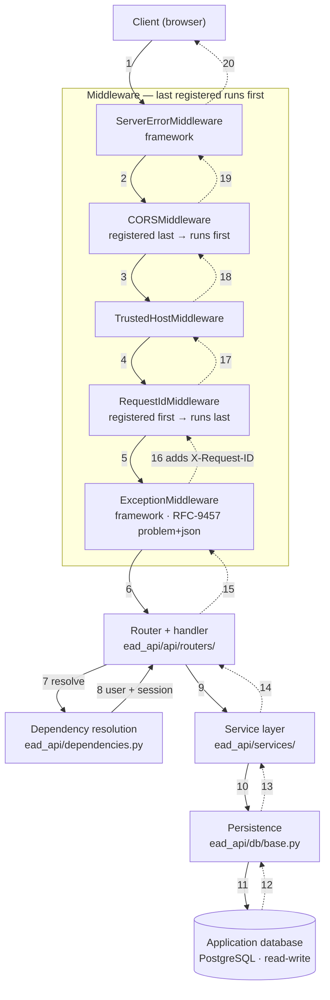
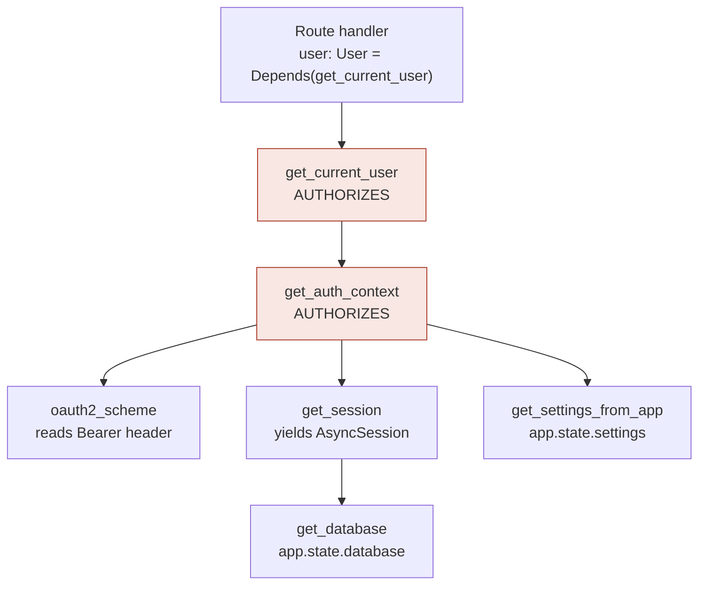
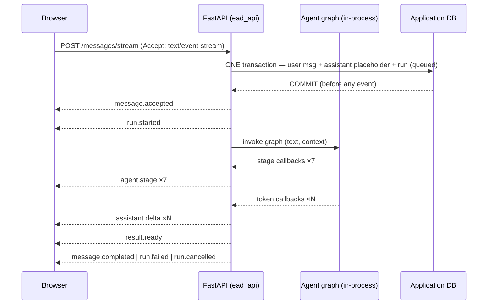
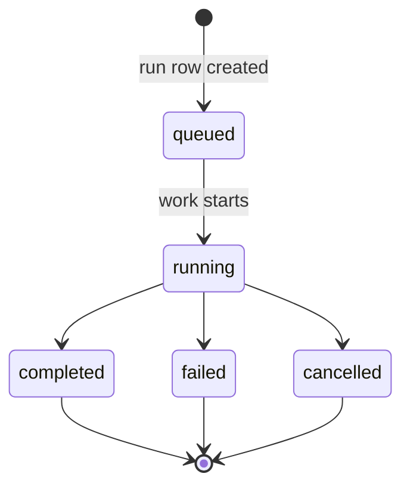
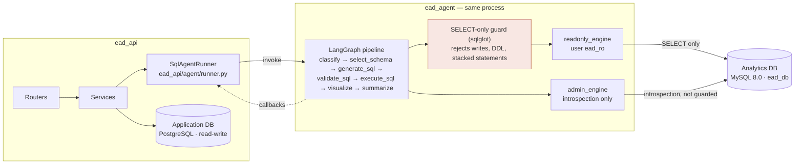
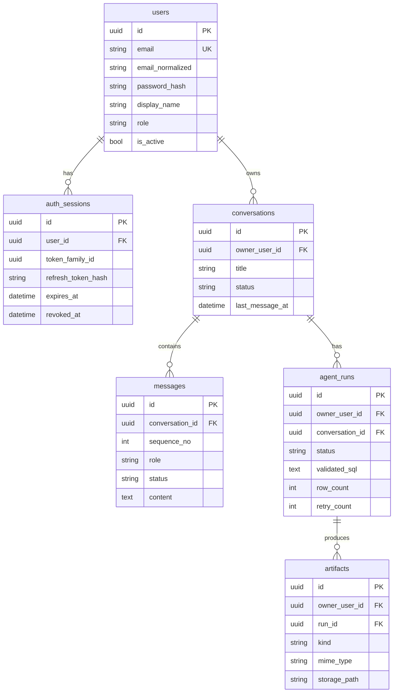

# FastAPI Architecture

Verified against source: middleware ordering against Starlette's
`build_middleware_stack`, event names from a live stream capture, run statuses
and columns from `ead_api/models.py`, database topology from `compose.yaml`.

## 1. Request lifecycle

`add_middleware` inserts at index 0 and the stack is built in reverse, so the
**last registration runs first**. `main.py` registers RequestId, TrustedHost,
then CORS — a request meets CORS first and RequestId last.

Steps 7 and 8 run before the handler body; a failed dependency returns 401
without the handler ever executing.

## 2. Dependency resolution

Every provider lives in the single file `ead_api/dependencies.py`. Only
`get_current_user` and `get_auth_context` authorize — the other four supply data
or resources.

Dependencies are cached per request, so one `AsyncSession` is shared by every
dependent. `get_session` yields, so the session closes after the response is
sent. Because the check lives in a dependency rather than in each handler, all
23 endpoints behave identically — which is why cross-tenant access consistently
returns 404 rather than leaking existence.

## 3. Streaming a chat turn

`POST /api/v1/conversations/{id}/messages/stream`

State is committed **before** streaming begins, so a dropped connection is
recovered by re-reading the run rather than replaying an in-memory buffer.
Exactly one terminal event is sent.

This is a POST SSE stream — browser `EventSource` only issues GET requests and
cannot send a JSON body, so clients must use streaming `fetch`. It also cannot
be exercised from Swagger UI.

## 4. Run status lifecycle

Statuses are database column values. They are **not** the SSE event names.

| Run statuses — database column | SSE events — wire protocol |
|---|---|
| `queued` (on creation) | `message.accepted` |
| `running` | `run.started` |
| `completed` · `failed` · `cancelled` | `agent.stage` · `assistant.delta` |
| | `result.ready` |
| | `message.completed` · `run.failed` · `run.cancelled` |

There is no `started` status and no `run.queued` event. Never rename one to
match the other.

## 5. Package boundary and the two databases

`admin_engine` bypasses the guard — introspection reads schema metadata, not
model-generated statements.

**The boundary is not network isolation.** `ead_agent` runs in-process inside
the API container, which holds credentials for both databases. It is enforced
at two levels: module ownership (only `ead_agent/db.py` builds analytics
engines) and a database grant —
`GRANT SELECT ON ead_db.* TO 'ead_ro'@'%'` — which is the part with real teeth,
since a write fails at the MySQL server even if every guard above it were
bypassed.

## 6. Data model — application database

`owner_user_id` on `agent_runs` and `artifacts` is what enforces owner-scoping.
`token_family_id` on `auth_sessions` is what lets refresh-token reuse revoke an
entire family rather than a single token.

LangGraph checkpoints also live in this database, in tables created by the
library's Postgres checkpointer rather than by `ead_api/models.py`.

## 7. Endpoint surface

| Router | Ops | Responsibility |
|---|---|---|
| `health` | 2 | Liveness, and readiness including a database ping |
| `auth` | 5 | Register, login, refresh rotation, logout, logout-all |
| `users` | 2 | Read and update the current profile |
| `conversations` | 6 | Create, list, search, read, rename or archive, soft-delete |
| `messages` | 5 | History, JSON chat, SSE chat, read, soft-delete |
| `runs` | 3 | Run status, cancellation, protected artifact download |

All under `/api/v1` except health. Every private lookup is scoped to the
authenticated owner; a cross-user request returns 404, never 403.
