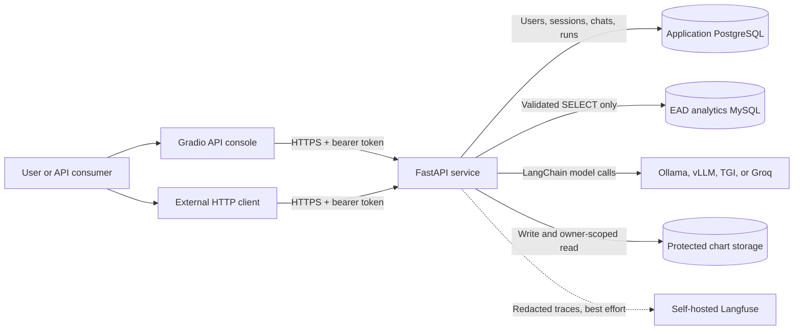
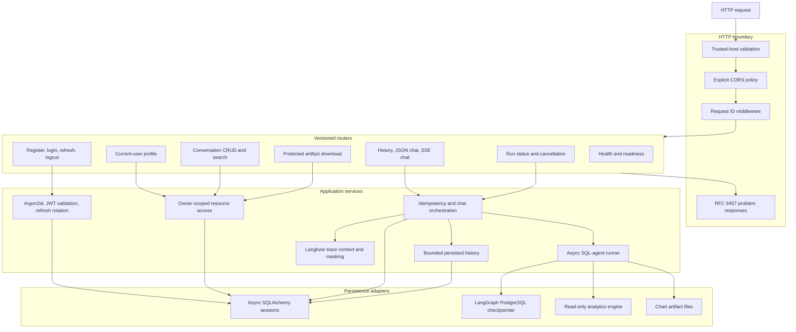
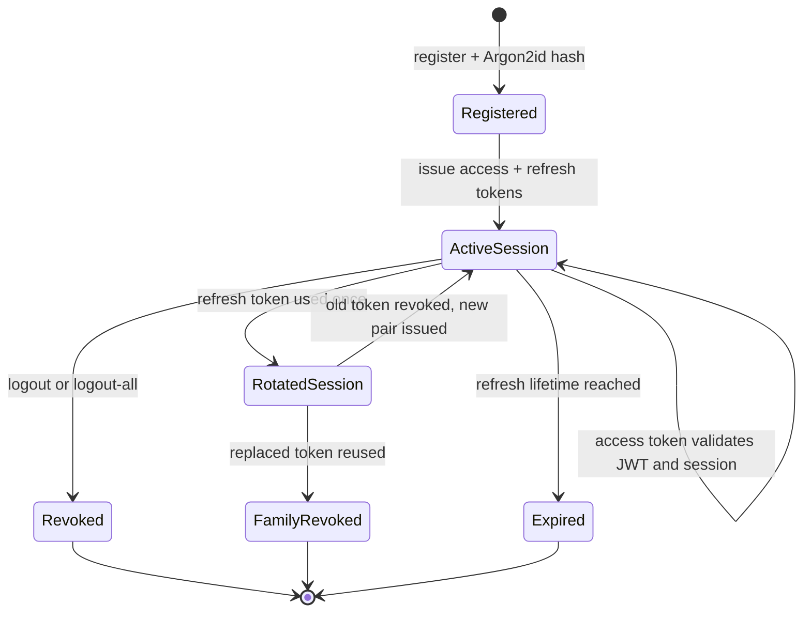
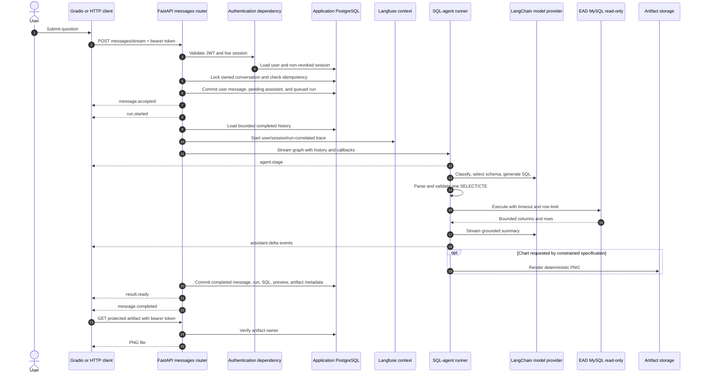
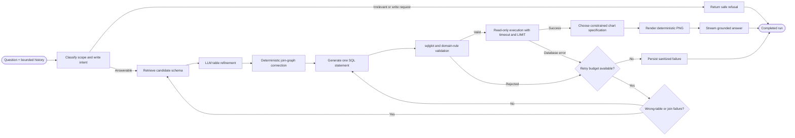
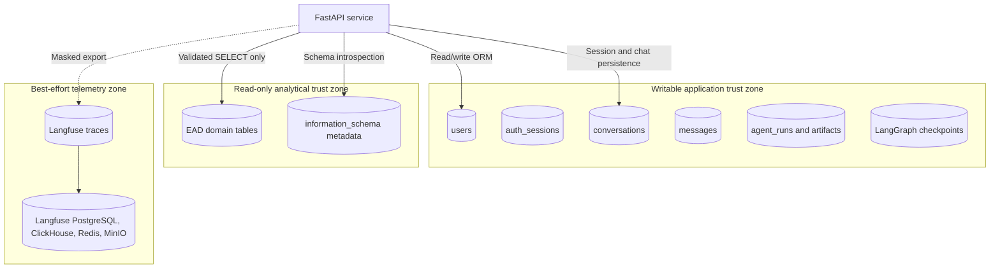
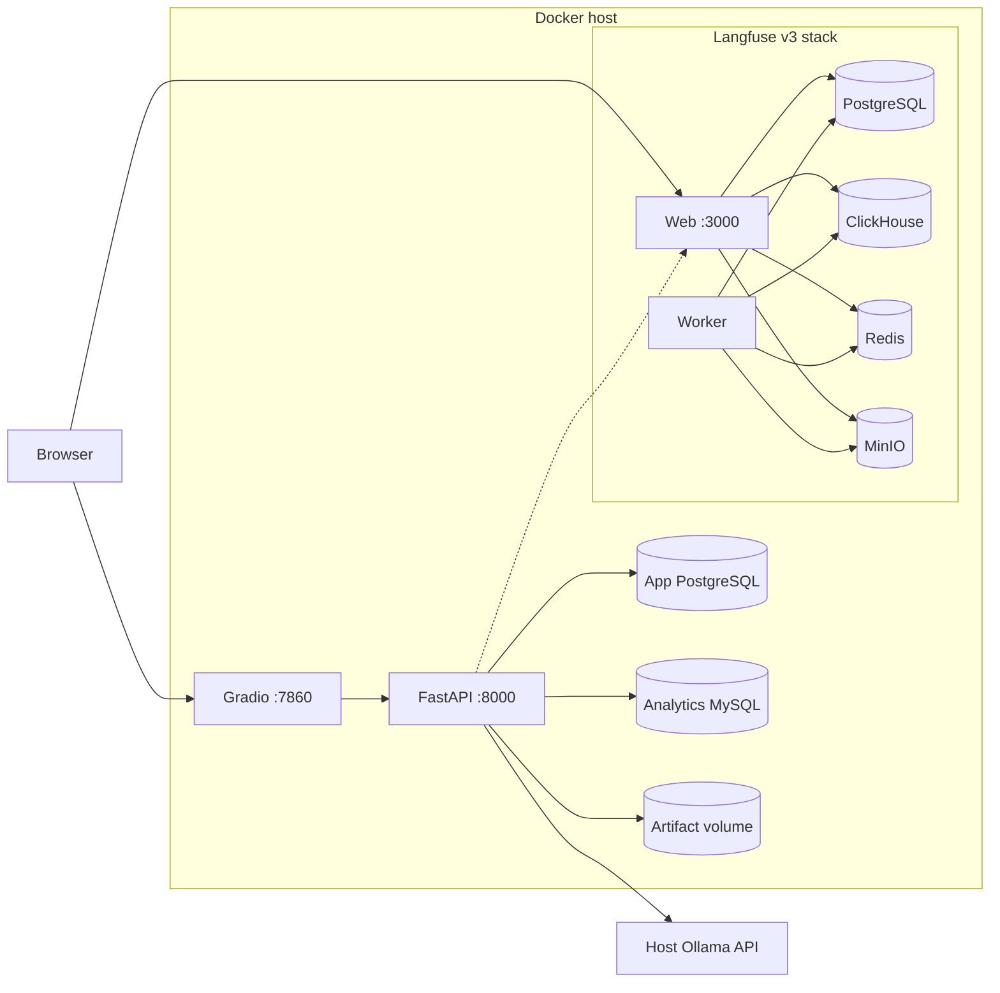

# Backend System Architecture

This document is the canonical functional map of the EAD SQL RAG backend. It
shows runtime boundaries, data ownership, request processing, agent execution,
streaming behavior, and the on-prem deployment topology.

## 1. System context

The Gradio console is not a trusted backend. It stores a user's API tokens in
Gradio session state and exercises the same public endpoints as any other
client. All authorization and ownership checks remain in FastAPI.

## 2. FastAPI functional architecture

### Functional ownership

| Function | Primary module | Durable state |
|---|---|---|
| Registration and login | `ead_api.services.auth` | Users and auth sessions |
| Access-token authorization | `ead_api.dependencies`, `ead_api.core.security` | Session revocation state |
| Refresh-token rotation/reuse detection | `ead_api.services.auth` | Hashed refresh-token family |
| Conversation CRUD/search | `ead_api.services.conversations` | Conversations |
| Ordered message history | `ead_api.services.messages` | User and assistant messages |
| Chat idempotency and active-run guard | `ead_api.services.chat` | Agent runs and constraints |
| Streaming SSE protocol | `ead_api.api.routers.messages` | Terminal state is persisted first |
| SQL-RAG execution | `ead_api.agent.runner`, `ead_agent` | Run preview and checkpoints |
| Chart delivery | `ead_agent.charts`, artifact router | PNG file plus ownership metadata |
| Tracing | `ead_api.core.observability` | Langfuse, non-canonical telemetry |

## 3. Authentication and session lifecycle

- Access tokens are short-lived JWTs with issuer, audience, algorithm, token
  type, user ID, and session ID validation.
- Refresh tokens are opaque. Only hashes are persisted, and successful refresh
  rotates the token.
- Private resource IDs never authorize access by themselves; database queries
  include the authenticated owner ID and return `404` for other users' data.

## 4. Streaming chat request sequence

If the client disconnects, cancellation is requested and the run is persisted as
cancelled when execution observes it. If execution fails, clients receive a
sanitized `run.failed` event while raw stack traces and database credentials stay
server-side.

## 5. SQL-RAG agent state machine

The retry paths share one bounded counter. SQL validation remains a security
boundary even when the model, schema retriever, or database returns an error.

## 6. Data ownership and trust zones

PostgreSQL messages are canonical chat history. LangGraph checkpoints support
execution continuity, and Langfuse supports diagnostics; neither replaces
user-visible message persistence.

## 7. Single-host Compose topology

Only the UI, API, and Langfuse web interfaces should be reachable through a TLS
reverse proxy. Database and telemetry storage ports remain private. The supplied
Compose topology is appropriate for local development and single-host pilots;
high availability requires externalized redundant state services and shared
artifact object storage.

## 8. Endpoint capability map

| Capability | Endpoint |
|---|---|
| Register | `POST /api/v1/auth/register` |
| Login and rotate refresh token | `POST /api/v1/auth/jwt/login`, `/refresh` |
| Revoke one or all sessions | `POST /api/v1/auth/jwt/logout`, `/logout-all` |
| Read/update current profile | `GET/PATCH /api/v1/users/me` |
| Create/list/search conversations | `GET/POST /api/v1/conversations`, `GET /search` |
| Read/update/archive/delete conversation | `GET/PATCH/DELETE /api/v1/conversations/{id}` |
| Read ordered history | `GET /api/v1/conversations/{id}/messages` |
| Non-streaming chat | `POST /api/v1/conversations/{id}/messages` |
| Streaming chat | `POST /api/v1/conversations/{id}/messages/stream` |
| Inspect or cancel run | `GET /api/v1/runs/{id}`, `POST /cancel` |
| Download owner-scoped chart | `GET /api/v1/artifacts/{id}` |
| Liveness/readiness | `GET /health/live`, `GET /health/ready` |
